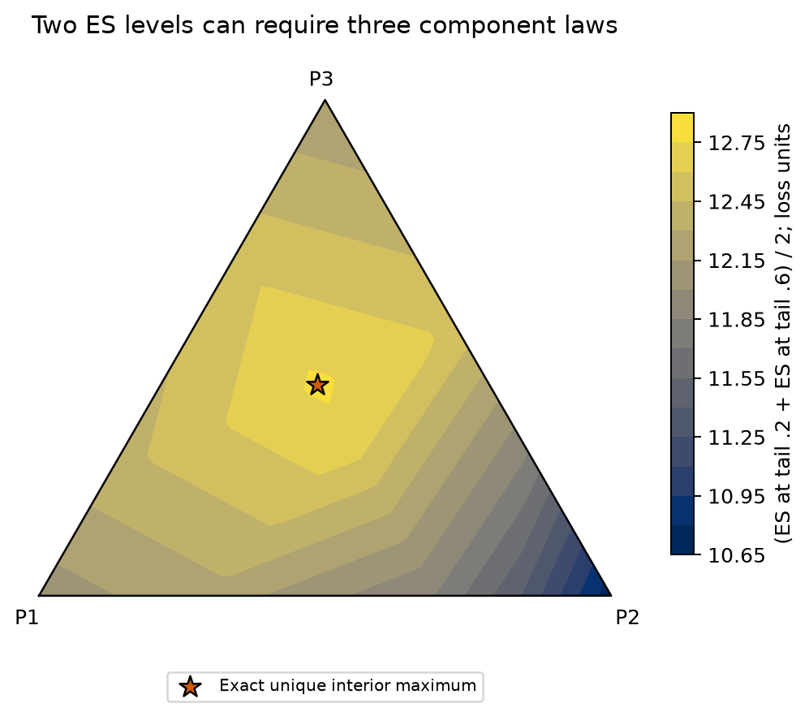
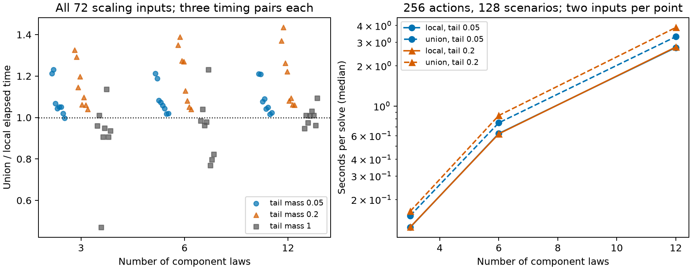

# Sparse component witnesses for expected-shortfall regret

**Working technical-note draft — 2026-10-08.** Human authors, venue and declarations are unassigned. Mathematical and computational checks below were performed with AI assistance; human source verification and submission approval are pending. Priority is not established. This banner is part of the draft. [claim:C024] [evidence:E110]

## Abstract

Consider a fixed bank of decisions evaluated under every probability mixture of finitely many component laws. We derive a sparse-witness property for the maximum difference between a decision's expected shortfall and the smallest expected shortfall in the bank under the same law. For any finite collection of integrable component laws, every decision has a worst-case mixture supported on at most two components. A positive sum of J nontrivial ES levels admits at most J+1 components; the bound is sharp for every J with distinct levels, even for two actions. For finitely supported laws, the one-level result yields an evaluator that shares a lower hull across decisions on each component edge and queries only each decision's own threshold knots. Across 168 frozen computational cases, its largest regret-vector discrepancy from the configured reference was 1.04e-14. Reference coverage included 29,847 unrestricted-simplex LP solves and 24 exact rational polyhedral audits. Speed gains against the same-hull union baseline were modest and input-dependent. The contribution is a derived structural reduction and its implementation; it does not introduce ES regret, establish a calibrated uncertainty set, or demonstrate better forecasting or investment performance. [claim:C001] [evidence:E101,E102,E103,E104,E110]

## 1. Problem and relation to prior work

Relative robust CVaR already evaluates a decision against the law-specific optimal decision. Huang et al. define this difference in Section2 and optimize it for a finite list of rival distributions in Section3. Their footnote4 separately discusses percentage regret. Our objective uses the absolute difference and enlarges a supplied finite law list to its entire mixture simplex. The continuous portfolio problem studied there and the fixed-bank evaluator studied here are distinct computational tasks. [claim:C002] [evidence:E002]

Full-simplex mixture ambiguity for worst-case CVaR is also established. Zhu and Fukushima's Theorem1 gives a common-threshold minimax representation for absolute worst CVaR. Pertaia and Uryasev's Proposition3.2 establishes concavity in mixture weights; their Section3.3 imposes a cardinality constraint in a distribution-fitting problem. We use the same concavity ingredient, but obtain sparse maximizers from the structure of a regret objective rather than imposing sparse fitted weights. [claim:C003] [evidence:E003,E004]

The atom-aware threshold representation follows Rockafellar and Uryasev's general-distribution formulation and Acerbi and Tasche's quantile characterization. Tselishchev gives a direct mixture-concavity proof and its spectral-risk extension. Generic moment sparsity is established by Winkler and by Pinelis, whose Theorem12 reproduces the former support bound. Henrion, Kružík and Weis formulate the corresponding smallest-face injectivity criterion. Our argument specializes this geometry to own-quantile strips; none of the generic ingredients is claimed as new. [claim:C004] [evidence:E001,E005,E006,E007,E011,E012]

Two additional comparisons delimit the objective. Tao and Deng study generalization bounds for CVaR-based minimax regret under a finite set of density-ratio weights. Bitar studies CVaR of ex-post regret under Wasserstein ambiguity. In general, ES(L_i)−min_j ES(L_j) differs from ES(L_i−min_j L_j), so those criteria must not be interchanged. [claim:C005] [evidence:E008,E009,E101]

Fan's two 2026 SSRN abstracts describe ES minimax regret, validation and extreme-point LP computation over risk-engine scores or convex aggregations of implemented risk functions. Our simplex mixes probability laws before evaluating ES. Those accessible descriptions concern different objects, but both full manuscripts were inaccessible, so closer theorem-level overlap remains unresolved. The targeted search did not locate the support-two regret statement, but this does not prove priority or publication novelty. [claim:C006] [evidence:E010,E013,E110]

## 2. Sparse-witness geometry

Let P_q=sum_{r=1}^R q_r P_r with q∈Δ_R. For fixed integrable losses L_i and fixed costs c_i, put F_i(q)=ES_α^{P_q}(L_i)+c_i, g(q)=min_j F_j(q), and H_i(q)=F_i(q)−g(q). The parameter α∈(0,1] is the upper-tail probability. Costs may be any fixed finite constants in the theorem; the implementation accepts nonnegative costs. All decisions use the same component weights. [claim:C007] [evidence:E101,E102]

**Proposition1 (two-component witness).** For every action i and 0<α<1, max_{q∈Δ_R} H_i(q) has an optimizer with at most two nonzero weights. For α=1 one component suffices. The laws need not have finite loss support. [claim:C008] [evidence:E101]

To see the mechanism, choose an upper quantile t of the evaluated action at a maximizing mixture. Define a_r=P_r(L_i>t), b_r=P_r(L_i≥t), and Q_i(t)={q∈Δ_R:aᵀq≤α≤bᵀq}. On Q_i(t), the RU threshold t remains optimal, so F_i is affine. Each bank ES is concave in q, hence g is concave and H_i is convex on Q_i(t). A vertex of that polytope attains at least the same regret. If both tail inequalities bind, their nonnegative difference forces all positively weighted components to have zero atom at t; the equalities then coincide on the support face. Thus the two inequalities contribute at most one independent active constraint, which allows at most two positive weights. Uniformly bounded quantiles across finitely many component laws give continuity and attainment even for integrable unbounded losses. Full endpoint and degeneracy details appear in [THEORY.md](THEORY.md). [claim:C009] [evidence:E101]

**Proposition2 (finite spectral extension).** For positive weights on J ES levels strictly between0 and1, an optimizer supported on at most J+1 components exists. An affine mean term does not increase the bound. Additional polyhedral ambiguity restrictions increase the bound by at most their active rank on the positive-support face. The bound is sharp for every J with distinct levels on the full simplex; sharpness for arbitrary additional constraint ranks is not claimed. [claim:C010] [evidence:E101]

The same proof intersects one fixed-quantile polytope per level. Each contributes at most one independent active equality. A rational J=2 example has unique optimizer (29412,26879,41646)/97937, with objective750784201/58762200; the best simplex-edge value is82963/6600, leaving positive gap1112324/5386535. This example rules out reusing the single-level edge certificate for a general multi-level sum. It is an exploratory mathematical construction, verified by exact vertex enumeration. [claim:C011] [evidence:E101,E104]

For any distinct ordered levels and positive weights, a general construction places J+1 component laws around a positive reference law at J adjacent-threshold kinks. On the nullspace of normalization and a midpoint supporting plane, every nonzero perturbation crosses at least one kink and strictly lowers spectral ES. A dual basis gives a unique uniform mixture maximizer and a positive quantitative gap from every boundary face. A zero-loss comparator converts this to regret with only two actions. The full construction, including atom degeneracies and positive component probabilities, is proved in the supplement. [claim:C027] [evidence:E101,E108]

 [claim:C025] [evidence:E104,E106]

Figure1. Two-level spectral regret against a constant-zero comparison action, in loss units. The color mesh is for visualization; exact rational enumeration supplies the marked optimizer and strict edge gap. Component laws and executable enumeration are in the supplement. [claim:C012] [evidence:E101,E104,E106]

## 3. Finite-support evaluator and controls

On each component edge, finite-law ES is a lower envelope of RU affine functions. The minimum across the bank is therefore one shared lower hull. On every own-threshold segment of action i, H_i is convex, so only the segment endpoints need queries. With K retained action thresholds, the hull/query stages cost O(K log K) on each edge, hence O(R²K log K) over the full simplex. Straightforward support sorting and coefficient construction add O(R²MS log S) for M actions and S scenarios. The real-arithmetic reduction is exact; reported implementations use float64 and declared numerical tolerances. [claim:C013] [evidence:E101,E102]

We compare against two controls. The union baseline uses the identical bank hull but queries every action on the union of all actions' knots, isolating the value of pruning. It is not an independent correctness implementation. The LP reference instead expands the negative benchmark RU envelope and optimizes every resulting concave piece over all R mixture coordinates. It does not invoke sparsity. An exact Fraction-based reference enumerates every full-dimensional own-quantile-cell active set, including both tail inequalities. [claim:C014] [evidence:E101,E102]

The frozen study contains72 LP-comparison inputs with2 or8 actions,8 or24 common scenarios,3/6/12 component laws, tail masses.05/.2/1, and two recipes per cell. A separate72-input scaling matrix uses64 or256 actions and32 or128 scenarios with the same other factors. Twenty-four rational cases use3/4 components,3 actions and6 scenarios. Ties, zero atoms and duplicate components are retained. Every edge solver receives three sequential timing repetitions; the LP reference is timed once. Source, config and runtime are hashed before development preflight and assessment. No forecasting model is fitted or selected. [claim:C015] [evidence:E102]

## 4. Results

All168 planned cases completed. The complete regret vectors agree within1.0436096431476471e-14, and recorded witnesses/competitors within1.1324274851176597e-14. There were0 raw argmin disagreements and0 captured numerical warnings. The separate LP comparator, independent of the edge-reduction assumption, executed29,847 LPs. Exact rational audits examined4,960 active-set systems; a separate verifier checked all72 stored rational action witnesses. A partial execution resumed from3 checkpoints, and the completed no-op resume preserved all168 checkpoint hashes. [claim:C016] [evidence:E103,E105]

Across all72 scaling inputs, the median paired union/local timing ratio is1.055 at tail.05,1.138 at tail.2 and.969 for the expectation control. At256 actions,128 scenarios and12 components, the two input-level ratios are1.209–1.211 at tail.05 and1.370–1.434 at tail.2. The local method is faster on56/72 input medians, with slower cases retained. At α=1 both methods call the same mean shortcut; differences reflect timing noise. These are descriptive machine timings, not inferential population estimates. [claim:C017] [evidence:E106]

 [claim:C026] [evidence:E106]

Figure2. Left: every input's median of three paired timing ratios, including slower cases and the mean control. Right: medians over two input medians for the largest action/scenario configuration. No confidence interval is implied by the two inputs. Timing denominators and the generic LP's single-timing limitation are retained in the CSV. [claim:C018] [evidence:E106]

A separate mathematical diagnostic used32 mixture points from normal and Student-t3 components and checked96 action-specific quantile polytopes. In every case an enumerated support-two vertex had no smaller regret than the input mixture, to the declared tolerance. This is a constructive diagnostic of the proof step, not a global continuous-law optimization benchmark. The exact J=2 fixture was also recomputed independently of its original search. [claim:C019] [evidence:E104]

After the frozen one-level study, a separate exploratory construction check instantiated J=1 through8 under two level/weight recipes. Exact rational identities and104 unrestricted spectral LPs verified all16 instances and every boundary face. The minimum measured boundary gap was3.2150e-5; the analytical bound proves strictness without relying on floating-point solves. No-op resume preserved all16 checkpoints. These deterministic diagnostics do not establish statistical generalization or production spectral-solver performance. [claim:C028] [evidence:E108]

## 5. Interpretation and limits

The useful structural fact is that adding arbitrarily many component laws does not require high-support adversaries for one ES level. It converts a full-simplex bank audit to edge computations with explicit witnesses. The proof is short and built from established ingredients; the strongest defensible framing is a specialized sparse-witness reduction and computational note. A broad claim of a new robust-CVaR method, a new regret definition, or established priority would exceed the literature audit. [claim:C020] [evidence:E101,E110]

The edge count grows quadratically in the number of components. The present speed improvements over the matched shared-hull baseline are modest, and a generic LP can be competitive for small banks with many components. Large-bank scaling cases were not checked with LP; they use the shared-code union control. Float64 witness agreement is not interval-arithmetic certification. Full-simplex results cannot be applied unchanged to credible regions, probability boxes, or nonlinear uncertainty sets. [claim:C021] [evidence:E101,E102,E103,E106]

The preceding policy experiment is separate, already viewed evidence. Its report found mixed/negative joint-policy behavior; it is not fresh confirmation for this note. No new empirical calibration, reserve utility, market profitability, continuous-action portfolio optimum, latent-state model, OIC reproduction or neural model was tested here. A computational reduction cannot supply the statistical meaning of an ambiguity set. [claim:C022] [evidence:E107,E102]

## Reproducibility and draft status

The supplement contains the proof, source comparison, frozen protocol, runnable modules, tests, original checkpoints, progress and resume receipts, all timing cells, and figure-generation code. Figures were computed from saved results, with no synthetic image generation. Authorship, funding, conflicts, target venue and any submission disclosure require human completion; none is inferred. Drafting can proceed from this package, while novelty priority and submission readiness remain unresolved. [claim:C023] [evidence:E101,E102,E103,E104,E105,E106,E108,E110]

References and exact source-access boundaries are recorded in [source_manifest.json](source_manifest.json) and [PRIOR_ART.md](PRIOR_ART.md). Claim IDs are linked by hashes in [claims.csv](claims.csv). These are AI-audited evidence records, not fabricated human verification.
